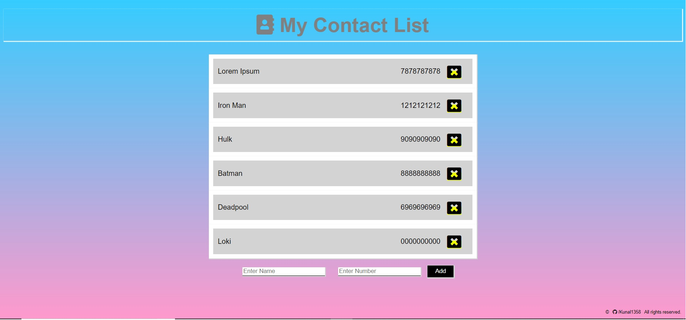

# Phone Book

A simple phonebook application.




### Built With

* [Node.js](https://nodejs.org/en/)
* [Express.js](https://expressjs.com/)
* [ejs](https://ejs.co/)  
* [MongoDB](https://www.mongodb.com/)  


### Pogram features

* You can add or remove contacts
* Your contacts will not get deleted when you turn off your servre. It get stored in Database and will be available evrry time you turn on/off server.


### Dependencies

```
npm install
```

### Executing program

```
node index.js
```


## Authors

[Kunal](https://github.com/Kunal1358)

